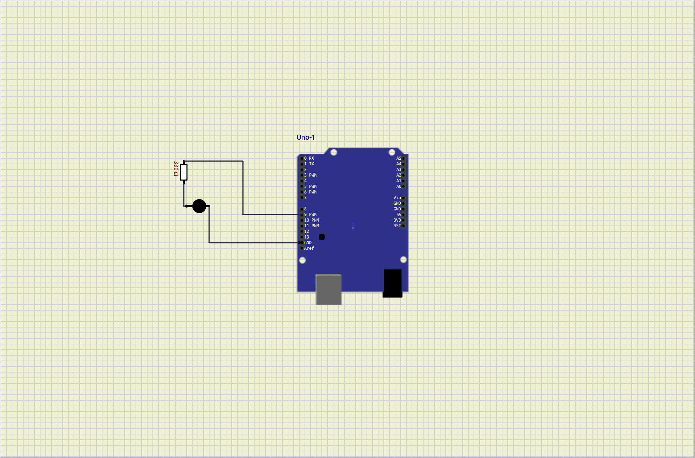
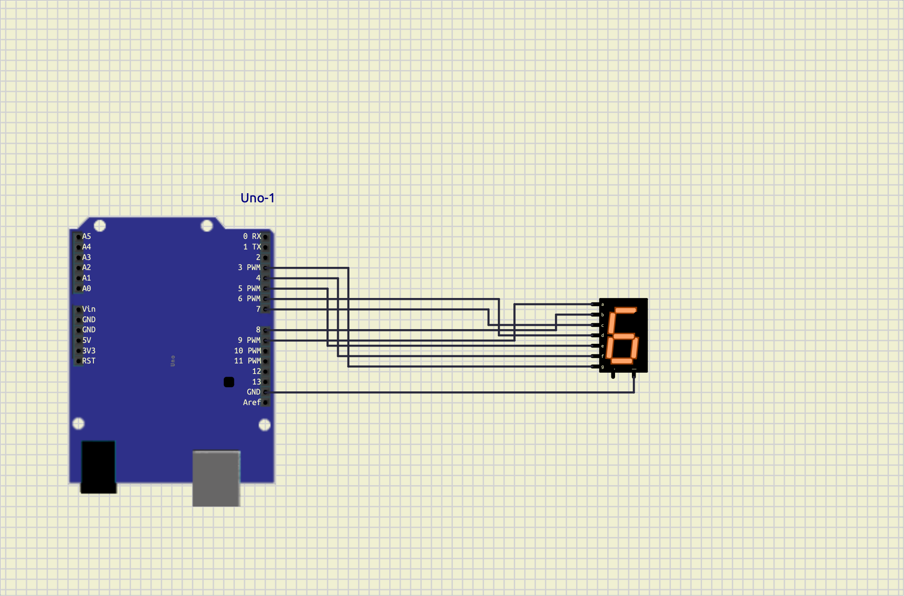
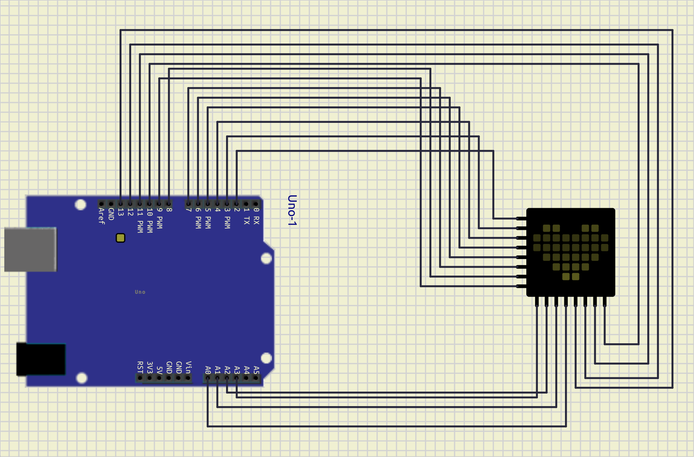

##2026_GIPEDI_KARUNA_SHARMA
## TABLE OF CONTENTS
1. OBJECTIVE 
2. TOOLS AND COMPONENTS REQUIRED
3. CIRCUIT DIAGRAM 
4. PROGRAM CODE 
5. WORKING 
6. OUTPUT/RESULT
7.LEARNING OUTCOMES 
8. PROBLEMS FACED AND THEIR SOLUTIONS 
9. REFERENCES
## LIST OF FIGURE 
1.1 ARDUINO UNO BOARD
1.2 ARDUINO IDE INTERFACE 
1.3 CIRCUIT DIAGRAM OF ARDUINO SETUP
2.1 SEVEN SEGEMENT LED INTERFACING CIRCUIT 
2.2 COUNTER OUTPUT ON SEVEN SEGMENT DISPLAY 
3.1 LED MATRIX INTERFACING CIRCUIT 
## LIST OF TABLE 
1.1 ARDUINO UNO SPECIFICATIONS 
1.2 COMPONENTS REQUIRED FOR EXPERIMENT 0 
2.1 PIN CONNECTIONS OF SEVEN SEGMENT DISPLAY 
2.2 LED MATRIX PIN CONFIGURATION 
3.1 LED MATRIX PATTERN DATA 
3.2 OBSERVATION AND RESULT TABLE


# EXPERIMENT 0: ARDUINO BASIC PROGRAM 


## OBJECTIVE:


- learn the components of an arduino uno circuit .
- understand how to connect basic electronic components. 

- write and upload a simple arduino program .
- verify the circuit through simulation .
## TOOLS REQUIRED
1. Arduino uno/esp32
2. LED
3. Arduino IDE
## CIRCUIT DIAGRAM


## ARDUINO CODE

```cpp
#include <const int ledPin = 9; // The digital pin connected to the LED Anode

void setup() {
  // Initialize digital pin 13 as an output.
  pinMode(ledPin, OUTPUT);
}

void loop() {
  digitalWrite(ledPin, HIGH);   // Turn the LED on
  delay(1000);                  // Wait for 1 second (1000 milliseconds)
  digitalWrite(ledPin, LOW);    // Turn the LED off
  delay(1000);                  // Wait for 1 second
}
>
```
## WORKING
The program turns the LED ON for one second and OFFfor one second repeatedly creating a blinking effect.
## LEARING OUTCOME 
Learned how to connect an LEDto arduino uno write a basic arduino program, and upload code to the board.
## PROBLEMS FACED AND SOLUTIONS
1.Problem:LED did not blink .
2.solution:checked wiring connections and upload the code again.
## FUTURE SCOPE
Tis experiment can be extended to control multiple LEDs and other electronic components.
## REFERENCES
1. Arduino IDEdocumentation 
2.Arduino uno datasheet
## EXPERIMENT 01 :
INTERFACING WITH SEVEN SEGMENT LED TO MAKE A COUNTER USING A PUSH BUTTON AS INPUT
## OBJECTIVE 
To interface a seven segment LEDdisplay with Arduino and use a push button to incrementband display a counter value.
## TOOLS REQUIRED
1. Arduino uno 
2. seven segment LED display (common cathode)
3. push button 
4. Arduino IDE
## THEROY 
A seven segment display consists of seven LEDS arranged in the shape of the number 8.by turning ON and OFF specific segments ,digits from 0 to 9 can be displayed.Apush button is used as an input device. each time the button is pressed, the counter value increases by one and the updated number is displayed on the seven -segment display.
## CIRCUIT DIAGRAM


## ARDUINO CODE 
  ```cpp
  ## include <sevseg.h>
  void setup (){
    //put your setup code here ,to run once :
    byte numdigits =1;
    byte digit _pins []={};
    byte seg_pins []={9,8,7,6,5,4,3,2};
    byte dis_type =COMMON_CATHODE;
    bool res_on_segs=true;
    s_seg.begin (dis_type,numdigit _pins ,seg_pins ,res_on_segs );
    s_seg.setbrightness(90);
  }
  void loop(){
    //put your main code here to run repeated:
    for (int i=0 ;i<10; i++)
    {
        s_seg.setnumber(i);
        s_seg.refreshdisplay ();
        delay(1000);
    }
  ```
  ## PROCEDURE 
  1. Connect the seven -segment display to arduino digital pins .
  2. connect the push button to the input pin. 
  3. upload the programto arduino uno .
  4. press  the push button repeatedly.
  5. observe the display number ( 1 to 9 )
  ## OBSERVATIONS 
  1. The display initially show 0. 
  2. Each button press increments the counter. 
  3. after reaching 9,the counter rests to 0.
  ## LEARNING OUTCOME 
 1. Learned how to interface a seven -segment display with arduino .
 2. Understood digital input using a push button .
3. Implemented a simple counter system.
## PROBLEM FACED AND SOULTIONS 
PROBLEM:
Incorrect digits displayedon the seven-segment display .
SOLUTION:
Checked segment pin connections and corrected the writing according to the circuit diagram .
## FUTURE SCOPE 
1. Two digital and four- digit counters.
2. visitor counting systems. 
3. digital scoreboards. 
4. electronic voting and counting applications .
## REFERENCES 
1.Arduino official Documentation 
2. seven segment display datasheet 
3 .arduino IDEuser guide
## EXPERIMENT 03 DISPLAY DIFFERENT PATTERNS ON LED MATRIX 
## OBJECTIVE 
To interface an LED matrix arduino and display different patterns ,symbols and designs on the matrix .
## TOOLS REQUIRED 
1. arduino uno
2. 8x8 LED matrix 
3. max 7219 led matrix driver module (if used )
## THEORY 
An LED matrix is a grid of LED arranged in rows and columns . by controlling the LEDs individually ,different patterns ,symbols ,charavters, and animations can be displayed the arduino sends data to the LEDmatrix to illuminate specific LEDs and create the desired pattern .
## CIRCUIT DIAGRAM 
 

 ## ARDUINO CODE 
 ```cpp
int pins[] = {2, 3, 4, 5, 6, 7, 8, 9, 10, 11, 12, 13}; // Added [] here

void setup() {
  for (int i = 0; i < 12; i++) {
    pinMode(pins[i], OUTPUT); // Fixed capital M and capitalized OUTPUT
  }
}

void loop() {
  for (int i = 0; i < 12; i++) {
    digitalWrite(pins[i], HIGH); // Fixed capital W
  }
  delay(1000); // Optional: adds a pause while they are ON
  
  for (int i = 0; i < 12; i++) {
    digitalWrite(pins[i], LOW); // Fixed capital W and capitalized LOW
  }
  delay(1000); // Optional: adds a pause while they are OFF
}

 ## PROCEDURE 
 1. Connect the LED matrix to the arduino . 
 2. upload the program using arduino IDE. 
 3. Run the circuit . 
 4. observe the displayed pattern on the LED matrix .
 5. modify the pattern data to display  different shapes and symbols.
 ## OBSERVATIONS 
 1. The led matrix sucessfully displayed the programmed pattern .
 2. different patterns can be created by changing the binary values in the code .
 3. the matrix can display symbols ,letters, numbers, and simple animations .
 ## LEARNING OUTCOME 
 1. learned how to interface an LED matrix with arduino 
 2. understood row and coluns addressing in LED matrices.
 3. Gained experience in creating visual patterns using programming
 ## PROBLEAMS 
 pattern was not displayed correctly .
 ## SOLUTION:
 Checked wiring connections and verified the binary pattern data in the coe .
 ## FUTURE SCOPE 
 1. Display scrolling text . 
 2. create animations and games 
 3. Design digital notice boards
 ## REFERENCES
 1. Arduino official documentation 
 2. max 7219 led matrix datasheet 
 3. Arduino LED matrix library documentation


