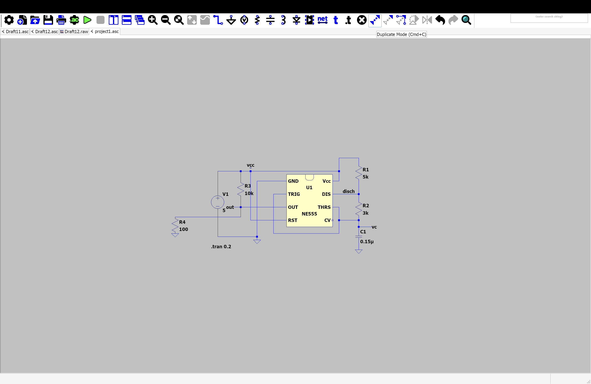
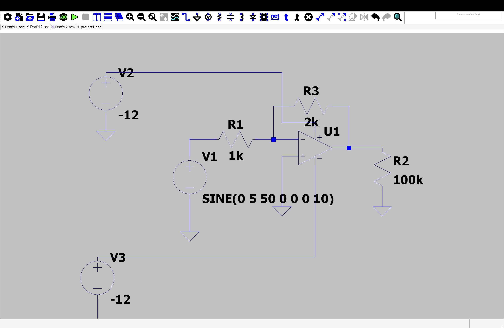
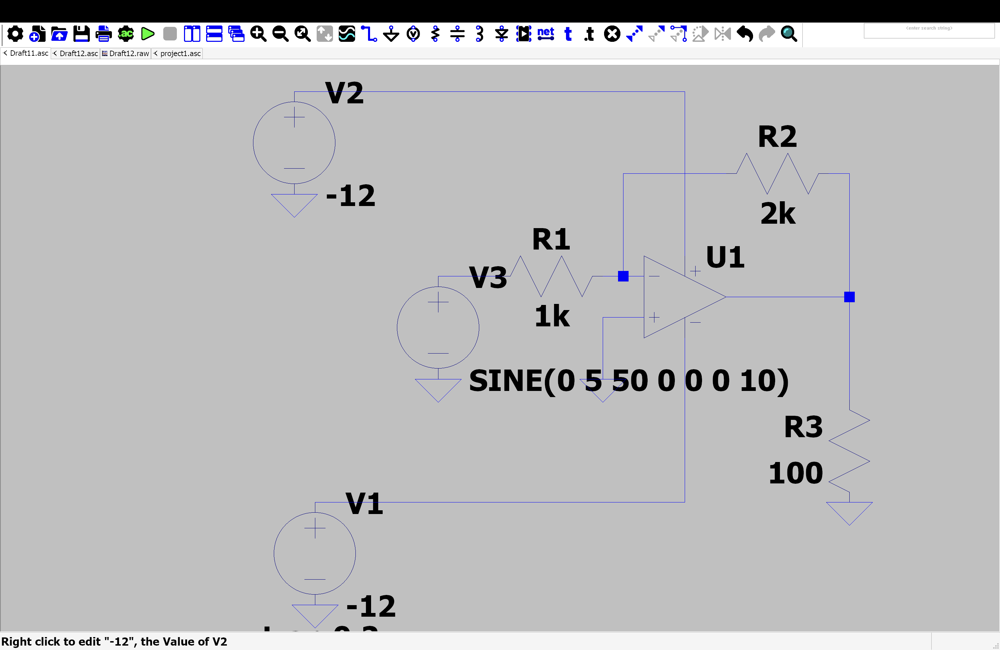

##2026_GIPEDI_KARUNA_SHARMA
## TABLE OF CONTENTS
1. OBJECTIVE 
2. TOOLS AND COMPONENTS REQUIRED
3. CIRCUIT DIAGRAM 
4. PROGRAM CODE 
5. WORKING 
6. OUTPUT/RESULT
7.LEARNING OUTCOMES 
8. PROBLEMS FACED AND THEIR SOLUTIONS 
9. REFERENCES
## LIST OF FIGURE 
1.1 ARDUINO UNO BOARD
1.2 ARDUINO IDE INTERFACE 
1.3 CIRCUIT DIAGRAM OF ARDUINO SETUP
2.1 SEVEN SEGEMENT LED INTERFACING CIRCUIT 
2.2 COUNTER OUTPUT ON SEVEN SEGMENT DISPLAY 
3.1 LED MATRIX INTERFACING CIRCUIT 
## LIST OF TABLE 
1.1 ARDUINO UNO SPECIFICATIONS 
1.2 COMPONENTS REQUIRED FOR EXPERIMENT 0 
2.1 PIN CONNECTIONS OF SEVEN SEGMENT DISPLAY 
2.2 LED MATRIX PIN CONFIGURATION 
3.1 LED MATRIX PATTERN DATA 
3.2 OBSERVATION AND RESULT TABLE


# EXPERIMENT 0: ARDUINO BASIC PROGRAM 


## OBJECTIVE:


- learn the components of an arduino uno circuit .
- understand how to connect basic electronic components. 

- write and upload a simple arduino program .
- verify the circuit through simulation .
## TOOLS REQUIRED
1. Arduino uno/esp32
2. LED
3. Arduino IDE
## CIRCUIT DIAGRAM


## ARDUINO CODE

```cpp
#include <const int ledPin = 9; // The digital pin connected to the LED Anode

void setup() {
  // Initialize digital pin 13 as an output.
  pinMode(ledPin, OUTPUT);
}

void loop() {
  digitalWrite(ledPin, HIGH);   // Turn the LED on
  delay(1000);                  // Wait for 1 second (1000 milliseconds)
  digitalWrite(ledPin, LOW);    // Turn the LED off
  delay(1000);                  // Wait for 1 second
}
>
```
## WORKING
The program turns the LED ON for one second and OFFfor one second repeatedly creating a blinking effect.
## LEARING OUTCOME 
Learned how to connect an LEDto arduino uno write a basic arduino program, and upload code to the board.
## PROBLEMS FACED AND SOLUTIONS
1.Problem:LED did not blink .
2.solution:checked wiring connections and upload the code again.
## FUTURE SCOPE
Tis experiment can be extended to control multiple LEDs and other electronic components.
## REFERENCES
1. Arduino IDEdocumentation 
2.Arduino uno datasheet
## EXPERIMENT 01 :
INTERFACING WITH SEVEN SEGMENT LED TO MAKE A COUNTER USING A PUSH BUTTON AS INPUT
## OBJECTIVE 
To interface a seven segment LEDdisplay with Arduino and use a push button to incrementband display a counter value.
## TOOLS REQUIRED
1. Arduino uno 
2. seven segment LED display (common cathode)
3. push button 
4. Arduino IDE
## THEROY 
A seven segment display consists of seven LEDS arranged in the shape of the number 8.by turning ON and OFF specific segments ,digits from 0 to 9 can be displayed.Apush button is used as an input device. each time the button is pressed, the counter value increases by one and the updated number is displayed on the seven -segment display.
## CIRCUIT DIAGRAM


## ARDUINO CODE 
  ```cpp
  ## include <sevseg.h>
  void setup (){
    //put your setup code here ,to run once :
    byte numdigits =1;
    byte digit _pins []={};
    byte seg_pins []={9,8,7,6,5,4,3,2};
    byte dis_type =COMMON_CATHODE;
    bool res_on_segs=true;
    s_seg.begin (dis_type,numdigit _pins ,seg_pins ,res_on_segs );
    s_seg.setbrightness(90);
  }
  void loop(){
    //put your main code here to run repeated:
    for (int i=0 ;i<10; i++)
    {
        s_seg.setnumber(i);
        s_seg.refreshdisplay ();
        delay(1000);
    }
  ```
  ## PROCEDURE 
  1. Connect the seven -segment display to arduino digital pins .
  2. connect the push button to the input pin. 
  3. upload the programto arduino uno .
  4. press  the push button repeatedly.
  5. observe the display number ( 1 to 9 )
  ## OBSERVATIONS 
  1. The display initially show 0. 
  2. Each button press increments the counter. 
  3. after reaching 9,the counter rests to 0.
  ## LEARNING OUTCOME 
 1. Learned how to interface a seven -segment display with arduino .
 2. Understood digital input using a push button .
3. Implemented a simple counter system.
## PROBLEM FACED AND SOULTIONS 
PROBLEM:
Incorrect digits displayedon the seven-segment display .
SOLUTION:
Checked segment pin connections and corrected the writing according to the circuit diagram .
## FUTURE SCOPE 
1. Two digital and four- digit counters.
2. visitor counting systems. 
3. digital scoreboards. 
4. electronic voting and counting applications .
## REFERENCES 
1.Arduino official Documentation 
2. seven segment display datasheet 
3 .arduino IDEuser guide
## EXPERIMENT 03 DISPLAY DIFFERENT PATTERNS ON LED MATRIX 
## OBJECTIVE 
To interface an LED matrix arduino and display different patterns ,symbols and designs on the matrix .
## TOOLS REQUIRED 
1. arduino uno
2. 8x8 LED matrix 
3. max 7219 led matrix driver module (if used )
## THEORY 
An LED matrix is a grid of LED arranged in rows and columns . by controlling the LEDs individually ,different patterns ,symbols ,charavters, and animations can be displayed the arduino sends data to the LEDmatrix to illuminate specific LEDs and create the desired pattern .
## CIRCUIT DIAGRAM 
 

 ## ARDUINO CODE 
 ```cpp
int pins[] = {2, 3, 4, 5, 6, 7, 8, 9, 10, 11, 12, 13}; // Added [] here

void setup() {
  for (int i = 0; i < 12; i++) {
    pinMode(pins[i], OUTPUT); // Fixed capital M and capitalized OUTPUT
  }
}

void loop() {
  for (int i = 0; i < 12; i++) {
    digitalWrite(pins[i], HIGH); // Fixed capital W
  }
  delay(1000); // Optional: adds a pause while they are ON
  
  for (int i = 0; i < 12; i++) {
    digitalWrite(pins[i], LOW); // Fixed capital W and capitalized LOW
  }
  delay(1000); // Optional: adds a pause while they are OFF
}
```

 ## PROCEDURE 
 1. Connect the LED matrix to the arduino . 
 2. upload the program using arduino IDE. 
 3. Run the circuit . 
 4. observe the displayed pattern on the LED matrix .
 5. modify the pattern data to display  different shapes and symbols.
 ## OBSERVATIONS 
 1. The led matrix sucessfully displayed the programmed pattern .
 2. different patterns can be created by changing the binary values in the code .
 3. the matrix can display symbols ,letters, numbers, and simple animations .
 ## LEARNING OUTCOME 
 1. learned how to interface an LED matrix with arduino 
 2. understood row and coluns addressing in LED matrices.
 3. Gained experience in creating visual patterns using programming
 ## PROBLEAMS 
 pattern was not displayed correctly .
 ## SOLUTION:
 Checked wiring connections and verified the binary pattern data in the coe .
 ## FUTURE SCOPE 
 1. Display scrolling text . 
 2. create animations and games 
 3. Design digital notice boards
 ## REFERENCES
 1. Arduino official documentation 
 2. max 7219 led matrix datasheet 
 3. Arduino LED matrix library documentation
 ## TABLE OF CONTENTS 
 1. TITLE 
 2 . AIM
 3. OBJECTIVE 
 4. COMPONENTS REQUIRED 
 5. CIRCUIT DIAGRAM 
6. PRODUCER
7. ADVANTAGE 
8. CONCLUSION 


## PROJECT REPORT ON 555 TIME IC
##TITLE
design and implementation of a 555 timer circuit
## AIM
TO study the working of the 555 timer ICand generate timing pulses using an astable multivibrator circuit 
## OBJECTIVE 
1. TO understand the operation of the 555 time IC 
2. To generate a continuous square wave output 
3. To observe the charging and discharging of a capacitor 
##COMPONENTS REQUIRED 
1. 555timer IC
2. Resistor r1 (1kohm)
3. Restistor R2(10k ohm)
capacitor c1 (10uf)
connecting wires

## CIRCUIT DIAGRAM 
 


 ##PROCRDURE 
 1. Place the timer IC on the breadboard 
 2. connect the power supply.
 3. turn on the power supply 
 4. observe the blinking led.
 ## observation 
 1. The LED blinking rate depends on the resister and capacitor value 
 2. The LED blinks continuously 
 3. Asquare wave is odtained at the output pin .
 ## APPLICATION 
 1. LED flashers 
 2. pulse generators 
 clock circuit 
 alarm system 
 ## ADVANTAGES 
 1. low 
 2. easy to use 
 3. reliable operation 
 ## CONCLUSION 
 The project demonstrated the working principle of the 555 time IC the circuit successfuly generated periodic pulses and showed how resistor and capacitor values affect the timming characteristic of the output signal .

 ##TABLE CONTENTS 
 1. AIM 
 2. OBJECTIVE 
 3. CIRCUIT DIAGRAM 
 4. APPLICATION 
 5. CONCLUSION

 ##INVERTING AND NON INVERTING AMPLIFIER USING OP AMP


 ## AIM
 To study and analyze the operation of inverting and non inverting amplifier using an operational amplifier (op amp)
 ##objective 
 1. to understand the working principle of inverting and non inverting amplifiers 
  2 . to calculate and verify the voltage gain of both amplifier configurations 
 3. To compare their charactersitics and applications .
 ##CIRCUIT DIAGRAN INVERTING AND NON-INVERTING 
    


## APPLICATION 
    INVERTING AMPLIFIER 
    1. Signal conditioning 
    2. Audio amplifiers 
    3. active filters 
    NON INVERTING AMPLIFIER 
    1. Voltage follows 
    2. sensor signal amplification 
    3. instrumentation circuits.
    ##CONCLUSION 
 ## TYPING REPORT

| sno | DATE | TYPING SCORE | 
| :--- | :--- | :--- | 
| 1. | 2/6/26| 24 |
| 2. | 3/6/26| 24| 
| 3. | 4/6/26 | 24| 
| 4.| 5/6/26|  22| 
| 5. | 6/6/26 | 23 | 
| 6.| 7/6/26| 26| 
| 7. | 8/6/26 | 30| 
| 8.| 9/6/26|  30| 
| 9. | 10/6/26 | 28| 
| 10 | 11/6/26 | 23 | 
| 11.| 12/6/26| 26| 
| 12. | 13/6/26| 27| 
| 13.| 14/6/26| 27 | 
| 14| 15/6/26 | 26| 
| 15| 16/6/26 | 26| 
| 16| 17/6/26| 25| 
| 17 | 18/6/26| 26| 
| 18.| 19/6/26| 25
19.| 20/6/26| 26| 
| 20. | 21/6/26| 27| 
| 21.| 22/6/26| 27 | 
| 22| 23/6/26 | 26| 
| 23| 24/6/26 | 26| 
| 24| 25/6/26| 25| 
| 25 | 26/6/26| 26| 
| 26.| 27/6/26| 25
| 27. | 28/6/26| 27| 
| 28.| 29/6/26| 27 | 
| 29| 30/6/26 | 30| 
| 30|1 /7/26 | 30| 
| 31| 2/7/26| 29| 
| 32 | 3/7/26| 30| 
| 33.| 4/7/26| 27
| 34| 5/6/26 | 29| 
| 35| 6/6/26 | 29| 
| 36| 7/6/26| 30| 

## HTML CODE WITH SQL DATABASE 
## AIM 
To create a simple web page using HTML and store user information in an SQL database .
## OBJECTIVE 
1.To design a user input form using HTML.
2. To store the entered data in an SQL database .
3. To retrieve and display records from the database .
  ## SOFTWARE REQUIRED 
  1. Notepad 
  2. XAMPP SERVER
  3. MYsql Database
  4. Sql
 ## INTRODUCTION 
 HTML (hyper text markup language ) is used to create web pages and collect user input through forms .SQL (Structure Query language ) is used to create and manage database .since HTML cannot communicate directly with a database , a server- side language such as PHPis used as an intermediary between HTMLand SQL .this project demonstrates a simple student registration system where student can enter thier details ,and the information is stored in a MYSQL database .
 ## software and hardware requirment 
 SOFTWARE REQUIREMENTS 
 1. Operating system : windows 10/11
 2. Text editor :NOTEPAD 
 3. XAMPP server 
 4. MySQL database 
   ## HARDWARE REQUIREMENTS 
   1. Computer or laptop 
   2. minimum 4GB RAM 
   3. 500 MB free dissk space 
   
   ## THEORY 
   HTML:
   HTML is the standard markup language used for creating web pages . it provides various elements such as forms , text boxes, button , and labels for user interaction .
   SQL :
   SQL is a language used to manage relational databsae .It allows user to create databases, table , insert record ,update data , and retrieve information .
   PHP :
   PHP is a server -side scripting language thatbprocesses from data and interacts with the MYSQL database .
   ## FLOW OF THE SYSTEM 
   4. User opens the registration page .
   5. user enters details in the html form. 
   6. the form sends data to the php file .
   7. php establishes a connection with MYSQL . 
   8. SQL query inserts the data into the database . 
   9. Asuccess message is displayed .

   
   ## HTML CODE 
   ~~~
  <!DOCTYPE html>
<html lang="en">
<head>
    <meta charset="UTF-8">
    <meta name="viewport" content="width=device-width, initial-scale=1.0">
    <title>My Web Page</title>
    <style>
        body {
            font-family: Arial, sans-serif;
            text-align: center;
            background-color: #f4f4f4;
            margin-top: 50px;
        }

        h1 {
            color: #333;
        }

        button {
            padding: 10px 20px;
            font-size: 16px;
            background-color: #4CAF50;
            color: white;
            border: none;
            border-radius: 5px;
            cursor: pointer;
        }

        button:hover {
            background-color: #45a049;
        }
    </style>
</head>
<body>

    <h1>Welcome to My Website</h1>
    <p>This is a simple HTML page.</p>

    <button onclick="showMessage()">Click Me</button>

    <script>
        function showMessage() {
            alert("Hello! Welcome to my website.");
        }
    </script>

</body>
</html>
~~~
## ADVANTAGE 
1. EASY Data management 
2. Reduces paperwork 
3. quick retrieval of records 
4. Improves accuracy and efficiency .
## APPLICATION 
1. School management systems
2. college recorg systems 
3. Employee management systems 
4. Library management systems
 
## OUTPUT 
The user enters the details in the HTML form,and the information is stored in the SQL datadase table .
## CONCLUSION 
The experiment sucessfully demonstrated how HTML can be used to collect user data and SQL can be used to store and manage that data in a database .

## BMS BUTTON 
## AIM 
To study the operation of a push button and control an output device using a BMS (Basic Monitoring/Management System).
## OBJECTIVE
To understand the working of push buttons and their application in automation and control systems.
## THORY 
A Button Control is a graphical user interface (GUI) element used to execute a command when clicked by the user. It is one of the most commonly used controls in BMS applications. Button controls help users interact with software easily and efficiently.
## SOFTWARE REQUIRED
1. BMS Software
2. COMPUTER SYSTEM 
## PROCEDURE 
1.open the BMS software
2. create a new project.
3. Drag and drop a Button Control onto the form.
4. Change the button text to "Click Me".
5. Write code for the button click event.
6. Run the application.
7. Click the button and observe the result.
 ## PROGRAM CODE 
~~~
<!DOCTYPE html>
<html lang="en">
<head>
    <meta charset="UTF-8">
    <meta name="viewport" content="width=device-width, initial-scale=1.0">
    <title>BMS Dashboard Sketch</title>
    <style>
        body {
            font-family: 'Courier New', Courier, monospace;
            background-color: #ffffff;
            padding: 30px;
        }
        .bms-card {
            border: 2px solid #000000;
            padding: 15px;
            width: 320px;
            background: #ffffff;
            margin-bottom: 5px;
        }
        .bms-card h3 {
            margin: 0 0 10px 0;
            font-size: 18px;
            letter-spacing: 1px;
        }
        .info-text {
            margin: 5px 0;
            font-size: 15px;
        }
        .top-btns {
            margin: 10px 0;
        }
        .small-btn {
            border: 1px solid #000;
            background: none;
            padding: 2px 8px;
            margin-right: 5px;
            font-size: 12px;
        }
        .btn-section {
            margin: 15px 0;
        }
        .row {
            margin-bottom: 8px;
            display: flex;
            align-items: center;
        }
        .clickable-btn {
            border: 2px solid #000000;
            background: #ffffff;
            padding: 5px 15px;
            margin-right: 8px;
            cursor: pointer;
            font-weight: bold;
            font-family: inherit;
        }
        .clickable-btn:hover {
            background: #f0f0f0;
        }
        .arrow-label {
            font-size: 14px;
        }
        .arrow-down {
            font-size: 24px;
            margin-left: 20px;
            margin-top: -5px;
            margin-bottom: 5px;
        }
        .details-box {
            border: 2px solid #000000;
            padding: 12px;
            width: 200px;
            background: #ffffff;
            margin-left: 10px;
        }
        .details-box p {
            margin: 4px 0;
            font-size: 14px;
        }
    </style>
</head>
<body>

    <div class="bms-card">
        <h3>BMS UI</h3>
        <div class="info-text">Total Volt: 0.8V</div>
        <div class="info-text">Connection: 2S (3.2V - 4.4V)</div>
        
        <div class="top-btns">
            <button class="small-btn">C1</button>
            <button class="small-btn">C2</button>
        </div>x

        <div class="info-text">No. of Cells: 2</div>

        <div class="btn-section">
            <div class="row">
                <button class="clickable-btn">C1</button>
                <button class="clickable-btn">C2</button>
                <span class="arrow-label">&rarr; clickable button</span>
            </div>
            <div class="row">
                <button class="clickable-btn">C3</button>
                <button class="clickable-btn">C4</button>
                <button class="clickable-btn">C5</button>
<button class="clickable-btn">C6</button>
            </div>
        </div>
    </div>

    <div class="arrow-down">&ShortDownArrow;</div>

    <div class="details-box">
        <p><b id="display-name">C1</b></p>
        <p>Battery Volt: <span id="display-volt">---</span></p>
        <p>Temp: <span id="display-temp">---</span></p>
        <p>Current State: <span id="display-state">---</span></p>
    </div>

    <script>
        const dataMap = {
            'C1': { volt: '3.6V', temp: '26°C', state: 'Normal' },
            'C2': { volt: '3.4V', temp: '28°C', state: 'Normal' },
            'C3': { volt: '1.1V', temp: '45°C', state: 'Hot' },
            'C4': { volt: '0.0V', temp: '24°C', state: 'Offline' },
            'C5': { volt: '3.5V', temp: '27°C', state: 'Normal' },
            'C6': { volt: '3.3V', temp: '26°C', state: 'Normal' }
        };


        document.querySelectorAll('.clickable-btn').forEach(btn => {
    btn.addEventListener('click', function() {
        const name = this.innerText.trim();
        const info = dataMap[name];

        if (info) {
            document.getElementById('display-name').innerText = name;
            document.getElementById('display-volt').innerText = info.volt;
            document.getElementById('display-temp').innerText = info.temp;
            document.getElementById('display-state').innerText = info.state;
        }
    });
});
</script>
~~~
 ## SCREENSHORT


 ## OBSERVATION 
1. The button appeared on the form.
Clicking the button 2. displayed a message box.
3. The button executed the assigned command correctly.
Result
   ## RESULT
   The Button Control was created successfully and performed the desired action when clicked.
   ## CONCLUSION
   The Button Control is an important GUI component used to interact with applications. The experiment demonstrated how a button can be created and programmed to perform specific tasks.